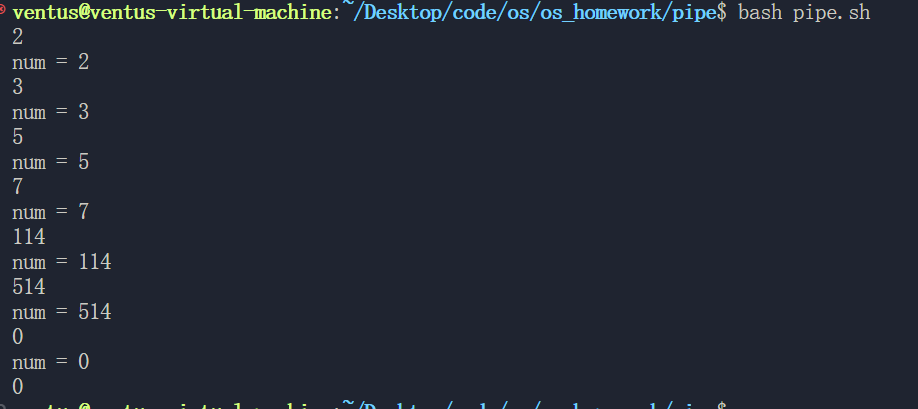

# 代码

```c
#include <stdio.h>
#include <stdlib.h>
#include <string.h>
#include <unistd.h>
#include <sys/types.h>
#define BUFFER_SIZE 1024

int main()
{
    int fd[2];
    pid_t pid;
    char buf[BUFFER_SIZE];
    memset(buf, 0, sizeof(buf));
    if (pipe(fd) == -1)
    {
        perror("pipe error");
        exit(1);
    }
    pid = fork();
    if (pid == -1)
    {
        perror("fork error");
        exit(1);
    }
    else if (pid == 0)
    {                 // 子进程
        close(fd[1]); // 关闭写端
        FILE *fp_odd = fopen("odd.txt", "w");
        if (fp_odd == NULL)
        {
            perror("fopen error");
            exit(1);
        }
        FILE *fp_even = fopen("even.txt", "w");
        if (fp_even == NULL)
        {
            perror("fopen error");
            exit(1);
        }
        while (read(fd[0], buf, BUFFER_SIZE))
        {
            int num = atoi(buf);
            printf("num = %d\n", num);
            if (num == 0)
            {
                break;
            }
            if (num % 2 == 0) // 偶数
            {
                fputs(buf, fp_even);
            }
            else // 奇数
            {
                fputs(buf, fp_odd);
            }
        }
        fclose(fp_odd);
        fclose(fp_even);
    }
    else
    {                 // 父进程
        close(fd[0]); // 关闭读端
        while (fgets(buf, BUFFER_SIZE, stdin))
        {                                   // 从终端读取数据
            write(fd[1], buf, strlen(buf)); // 写入管道
        }
    }
    return 0;
}

```

# 效果

以 0 作为输入的结束



```
//even.txt
2
114
514
```

```
//odd.txt
3
5
7
```

# 结论

## 实验目的

- 练习 Linux 下管道通信编程
  - 父进程创建一个子进程
  - 父进程负责读用户终端输入，并写入管道
  - 子进程从管道接收字符流，如果是奇数，写入文件 1；如果是偶数，写入文件 2

## 结论

这个程序展示了如何在 Linux 下使用管道进行进程间通信。

## 项目地址
