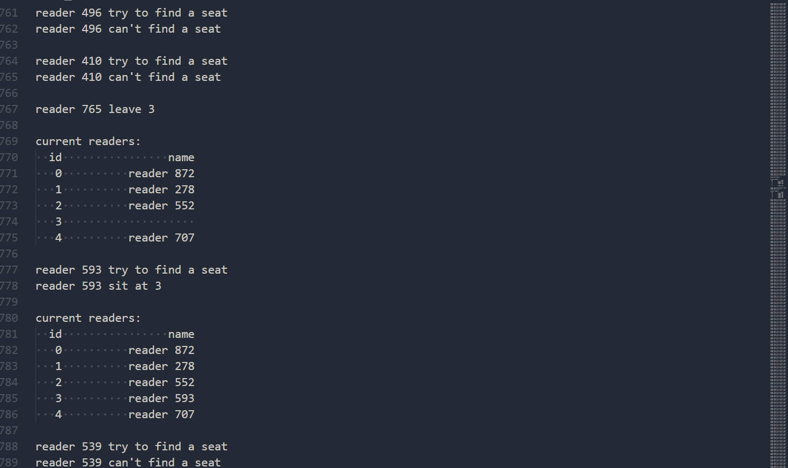

# 题目

有一阅览室，读者进入时必须先在一张登记表上进行登记，该表为每一座位列一表目，包括座号和读者姓名。读者离开时要消掉登记信号，阅览室中共有 100 个座位。用 PV 操作控制这个过程

# 效果

**测试脚本**

```bash
#!bin/bash
gcc -o test test.c -lpthread
./test 5 1000
```

**测试数据**


**压力测试脚本**

```bash
#!bin/bash
gcc -o pressure pressure.c -lpthread
for i in {1..100}
do
    echo "Test $i"
    read_num=$(($RANDOM%5000+5000))
    ./pressure 100 $read_num
done
```

压力测试中无报错，无死锁

# 说明

阅览室有一登记表。读者来时和读者离开时都要修改登记表。所以将其理解为一个受保护的数据结构。

对数据结构内数据的修改都需要满足是原子操作。

我的实现取其最简单的情况:一个定长的数组。用一个信号量保证，每次至多有一个线程能够使用数组内的数据。

# 伪代码

```
semaphore mutex=1;
ADT registrationForm;
void reader(string name){

    signature(name)；
    readingFunc();//在阅览室内阅读直到离开
    P(mutex);
    registrationForm.remove(name);
    V(mutex);
}
/**
 * 在登记表上签名，直到把名字签上
 *
 * @param name 读者的名字
 */
void signature(string name){
    while (1){
        P(mutex);
        if (!registration_form.isFull){
            registration_form.insert(name);
        }
        V(mutex);
    }
}
```

# 代码

```c
#include <semaphore.h>
#include <stdio.h>
#include <stdlib.h>
#include <pthread.h>
#include <unistd.h>
#include <string.h>
#define record_max_num 100
#define reader_max_num 10000
int record_num = 0, reader_num = 0;
typedef struct
{
    char name[record_max_num][20];
    sem_t sem;
} protected_records;
protected_records records;
char name[reader_max_num][20];
pthread_t reader_thread[reader_max_num];
void print_record()
{
    printf("current readers:\n");
    printf("%4s%20s\n", "id", "name");
    for (int i = 0; i < record_num; i++)
    {
        printf("%4d%20s\n", i, records.name[i]);
    }
    printf("\n");
}
void *reader(void *arg)
{
    char *name = (char *)arg;
    int id;
    while (1)
    {
        sem_wait(&records.sem);
        printf("%s try to find a seat\n", name);
        id = -1;
        for (int i = 0; i < record_num; i++)
        {
            if (records.name[i][0] == '\0')
            {
                id = i;
                break;
            }
        }
        if (id == -1)
        {
            printf("%s can't find a seat\n\n", name);
            sem_post(&records.sem);
        }
        else
        {
            printf("%s sit at %d\n\n", name, id);
            sprintf(records.name[id], "%s", name);
            print_record();
            sem_post(&records.sem);
            break;
        }
        usleep(20);
    }
    usleep(20);
    sem_wait(&records.sem);
    printf("%s leave %d\n\n", name, id);
    records.name[id][0] = '\0';
    print_record();
    sem_post(&records.sem);
}

int main(int argc, char **argv)
{
    freopen("test.out", "w", stdout);
    if (argc != 3)
    {
        printf("usage: ./test record_num reader_num\n");
        return 0;
    }
    for (int i = 1; i < argc; i++)
    {
        record_num = atoi(argv[1]);
        if (record_num > record_max_num)
        {
            printf("record number should be less than %d\n", record_max_num);
            return 0;
        }
        reader_num = atoi(argv[2]);
        if (reader_num > reader_max_num)
        {
            printf("reader number should be less than %d\n", reader_max_num);
            return 0;
        }
    }
    printf("record number: %d\n", record_num);
    printf("reader number: %d\n", reader_num);
    srand(time(NULL));
    sem_init(&records.sem, 0, 1);
    for (int i = 0; i < record_num; i++)
    {
        records.name[i][0] = '\0';
    }
    for (int i = 0; i < reader_num; i++)
    {
        char tname[20];
        sprintf(tname, "reader %d", i);
        strcpy(name[i], tname);
    }
    for (int i = 0; i < reader_num; i++)
    {
        pthread_create(&reader_thread[i], NULL, reader, (void *)name[i]);
    }
    for (int i = 0; i < reader_num; i++)
    {
        pthread_join(reader_thread[i], NULL);
    }
    sem_destroy(&records.sem);

    return 0;
}
```

# 结论

模拟了阅览室读者登记过程中的并发控制问题，并使用了信号量来实现对受保护数据结构的原子访问。

# 具体项目地址

https://github.com/nyml2003/os_homework/tree/main/read_room
