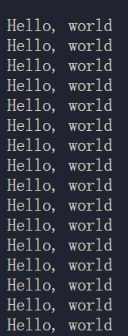
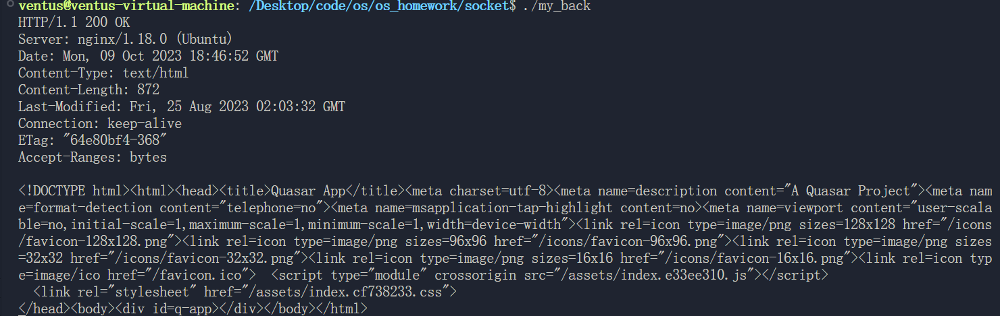

# 效果



# 结论

- 练习 Socket 编程
  - 一个进程利用 send 函数发信息
  - 一个进程利用 recv 接收信息并显示

虽然可以用 fork，但还是开两个 shell 分别运行 send 和 recv 效果更好

# 代码

```c
#include <sys/types.h>
#include <sys/socket.h>
#include <netinet/in.h>
#include <string.h>
#include <unistd.h>
#include <arpa/inet.h>
#include <stdio.h>

void sender()
{
    int sockfd;
    struct sockaddr_in serv_addr;

    sockfd = socket(AF_INET, SOCK_STREAM, 0);
    bzero(&serv_addr, sizeof(serv_addr));

    serv_addr.sin_family = AF_INET;
    serv_addr.sin_port = htons(6000);
    serv_addr.sin_addr.s_addr = inet_addr("127.0.0.1");

    connect(sockfd, (struct sockaddr *)&serv_addr, sizeof(serv_addr));
    int num = 0;
    while (1)
    {
        char buffer[256];
        bzero(buffer, 256);
        sprintf(buffer, "%d", num++);
        sleep(1);
        write(sockfd, buffer, strlen(buffer));
    }

    close(sockfd);
}

void receiver()
{
    int sockfd, newsockfd;
    struct sockaddr_in serv_addr, cli_addr;
    socklen_t clilen;
    char buffer[256];

    sockfd = socket(AF_INET, SOCK_STREAM, 0);
    bzero((char *)&serv_addr, sizeof(serv_addr));

    serv_addr.sin_family = AF_INET;
    serv_addr.sin_port = htons(6000);
    serv_addr.sin_addr.s_addr = INADDR_ANY;

    bind(sockfd, (struct sockaddr *)&serv_addr, sizeof(serv_addr));

    listen(sockfd, 5);

    clilen = sizeof(cli_addr);

    newsockfd = accept(sockfd, (struct sockaddr *)&cli_addr, &clilen);

    while (1)
    {
        bzero(buffer, 256);
        read(newsockfd, buffer, 255);
        printf("%s\n", buffer);
    }

    close(newsockfd);
    close(sockfd);
}
int main()
{
    if (fork())
    {
        sender();
    }
    else
    {
        receiver();
    }
    return 0;
}
```

## maybe 前端


详情请看

https://github.com/nyml2003/os_homework/blob/main/socket/my_back.c
